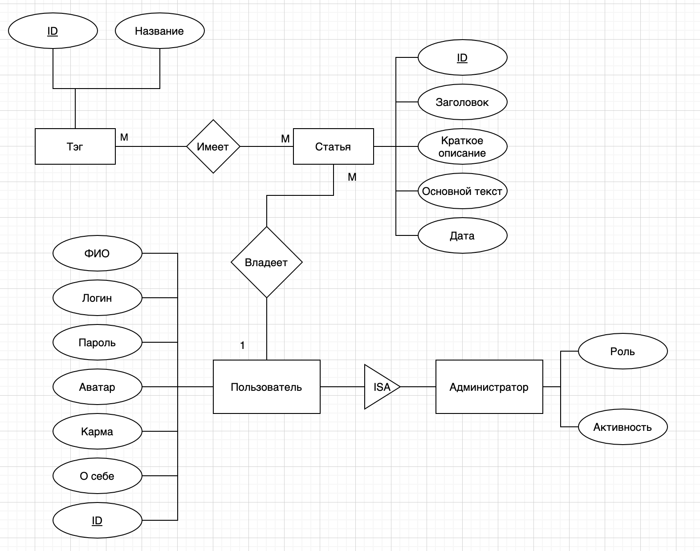

### 1. На основе описания предметной области выделить сущности (от 4-х до 6-ти), их атрибуты и связи. Указать ключевые атрибуты и типы связей. Построить ER-модель. Продемонстрировать в модели связи один-ко-многим (1-М) и многие-ко-многим (М-М), связь типа ISA.



### 2. На основе описания предметной области построить объектную модель БД на языке ODL. Привести описания классов, их свойств, методов и связей. Указать ключи и экстенты. Методы классов следует выделять так, чтобы их можно было использовать в типовых запросах вместо вложенных подзапросов. Продемонстрировать наследование, интерфейсы, сложные типы данных (коллекции и структуры).

```odl
interface IUser
{
    attribute integer ID;
    attribute string about;
    attribute integer karma;
    attribute string avatar;
    attribute string password;
    attribute string login;
    attribute struct {string F, string I, string O} FIO;

    FIO get(ID) raises(noUser);

    relationship set<Post> Posts inverse Post::User
};

class User
extends IUser
(extent ConstUser_PK key ID)
{};

class Admin
extends IUser
(extent ConstAdmin_PK key ID)
{
    attribute string Role;
    attribute bool Active;
};

class Post
(extent ConstPost_PK key ID)
{
    attribute integer ID;
    attribute string header;
    attribute integer short_topic;
    attribute string main_topic;
    attribute date date;

    relationship User TopicUser inverse User::Posts
    relationship set<Tag> Tags inverse Tag::Posts
};

class Tag
(extent ConstTag_PK key ID)
{
    attribute integer ID;
    attribute string name;

    relationship set<Post> Posts inverse Post::Tags
};
```

### 3. На основе объектной модели построить реляционную модель. Привести перечень отношений с указанием их атрибутов и ключей. Составить на языке SQL описание схемы базы данных (создание таблиц, задание первичных и внешних ключей, ограничений и т.д.). Продемонстрировать реализацию отношения наследования тремя различными методами.


```sql
SET FOREIGN_KEY_CHECKS = 0;

DROP TABLE IF EXISTS USER;

DROP TABLE IF EXISTS Admin;

DROP TABLE IF EXISTS Post;

DROP TABLE IF EXISTS Tag;

DROP TABLE IF EXISTS PostTag;

SET FOREIGN_KEY_CHECKS = 1;

-- Наследование

-- Сущностный подход
CREATE TABLE `User` (
    ID integer NOT NULL,
    about text NOT NULL,
    karma text NOT NULL,
    avatar text NOT NULL,
    `password` text NOT NULL,
    `login` text NOT NULL,
    first_name text NOT NULL,
    last_name text NOT NULL,
    middle_name text NOT NULL,
    PRIMARY KEY (ID)
);

CREATE TABLE `Admin` (
    LIKE `User` INCLUDING defaults INCLUDING constraints INCLUDING indexes,
    `role` text NOT NULL,
    active text NOT NULL
);

-- Пустые значения
CREATE TABLE `User` (
    ID integer NOT NULL,
    about text NOT NULL,
    karma text NOT NULL,
    avatar text NOT NULL,
    `password` text NOT NULL,
    `login` text NOT NULL,
    first_name text NOT NULL,
    last_name text NOT NULL,
    middle_name text NOT NULL,
    `role` text NULL,
    active text NULL,
    PRIMARY KEY (ID)
);

-- Объектный
CREATE TABLE `User` (
    ID integer NOT NULL,
    about text NOT NULL,
    karma text NOT NULL,
    avatar text NOT NULL,
    `password` text NOT NULL,
    `login` text NOT NULL,
    first_name text NOT NULL,
    last_name text NOT NULL,
    middle_name text NOT NULL,
    PRIMARY KEY (ID)
);

CREATE TABLE `Admin` (
    user_id integer,
    `role` text NOT NULL,
    active text NOT NULL,
    FOREIGN KEY (user_id) REFERENCES `User` (ID)
);

CREATE TABLE Post (
    ID integer NOT NULL,
    header text NOT NULL,
    short_topic text NOT NULL,
    main_topic text NOT NULL,
    `date` date NOT NULL,
    user_id integer NOT NULL,
    PRIMARY KEY (ID)
);

CREATE TABLE Tag (
    ID integer NOT NULL,
    `name` text NOT NULL,
    PRIMARY KEY (ID)
);

CREATE TABLE PostTag (
    tag_id integer NOT NULL,
    post_id integer NOT NULL
);

ALTER TABLE Post
    ADD FOREIGN KEY (user_id) REFERENCES `User` (ID);

ALTER TABLE PostTag
    ADD FOREIGN KEY (post_id) REFERENCES Post (ID),
    ADD FOREIGN KEY (tag_id) REFERENCES Tag (ID),
    ADD CONSTRAINT u_post_tag UNIQUE (post_id, tag_id);
```

### 4. На основе описания предметной области построить объектно-реляционную модель. Привести описания типов данных UDT с указанием их свойств и методов. На основе пользовательских типов составить схемы отношения. Для каждого отношения указать ключи, ссылочный атрибут, ограничения и т.д. Задать связи между отношениями. Для любых двух пользовательских типов задать правила сравнения: 1) на равенство и полное, 2) по-элементное и через функцию. Привести описание функций сравнения. Продемонстрировать наследование, ссылки и сложные типы данных. Принцип определения методов UDT соответствует принципам определения методов класса.

Пользователь: (ID, о себе, карма, аватар, пароль, логин, имя(Фамилия, Имя, Отчество));

Администратор: (Пользователь: (ID, о себе, карма, аватар, пароль, логин, имя(Фамилия, Имя, Отчество)), роль, активность);

Статья: (ID, заголовок, краткое описание, текст, дата, пользователь_ID(*Пользователь));

Тэг: (ID, название);

ТэгиСтатьи: (тэг_ID(*Тэг), пост_ID(*Пост));

```sql
CREATE TYPE FIO AS (
    last_name text,
    first_name text,
    father_name text
) 
method fullName () RETURNS text;

CREATE method fullName RETURNS text
FOR FIO
BEGIN
    RETURN SELF.last_name || SELF.first_name || SELF.father_name
END;

CREATE TYPE UserT AS (
    ID integer,
    about text,
    karma text,
    avatar text,
    `password` text,
    `login` text,
    fullname FIO,
);

CREATE TYPE AdminT under UserT AS (
    `role` text,
    active text
);

CREATE TYPE PostT AS (
    ID integer,
    header text,
    short_topic text,
    main_topic text,
    `date` date,
    Users REF (UserT) SCOPE `User`
);

CREATE TYPE TagT AS (
    ID integer,
    `name` text,
);

-- tables
CREATE TABLE `User` OF UserT (
    PRIMARY KEY (ID),
);

CREATE TABLE `Post` OF PostT (
    PRIMARY KEY (ID),
    REF IS Idc SYSTEM GENERATED
);

CREATE TABLE `Tag` OF TagT (
    PRIMARY KEY (ID),
);

CREATE TABLE PostTag (
    Tags REF (TagT) SCOPE Tag,
    Post REF (PostT) SCOPE Post,
);

CREATE TABLE `Admin` OF AdminT ();

CREATE ORDERING FOR TextType EQUALS ONLY BY STATE

CREATE ORDERING PostT ORDER FULL BY RELATIVE WITH Fun 
CREATE FUNCTION Fun (IN S1 PostT, IN S2 PostT) 
RETURNS integer
IF S1.header()<>S2.header() THEN RETURN (-1)
ELSEIF S1.short_topic()<>S2.short_topic() THEN RETURN (-1) 
ELSEIF S1.main_topic()<>S2.main_topic() THEN RETURN (-1) 
ELSEIF S1.date()<S2.date() THEN RETURN (-1) 
ELSEIF S1.date()>S2.date() THEN RETURN (1) 
ELSE RETURN(0) 
ENDIF;
```

### 5. На основе описания предметной области построить модель полуструктурированных данных. Привести пример графа полуструктурированных данных, соответствующий ему XML-документ и DTD-определение.

#### XML
```xml
<?xml version="1.0" encoding="utf-8" standalone="no"?>
<!DOCTYPE mydb SYSTEM "db.dtd">
<mydb>
    <user idu="u1">
        <id>1</id>
        <about>Обо мне</about>
        <karma>0</karma>
        <avatar>/static/default.png</avatar>
        <password>empty</password>
        <login>a.petrov</login>
        <first_name>Андрей</first_name>
        <last_name>Петров</last_name>
        <middle_name>Андреевич</middle_name>
    </user>

    <post idp="p1" tot="t1" tou="u1">
        <id>1</id>
        <header>header</header>
        <short_topic>short topic about post</short_topic>
        <main_topic>main topic</main_topic>
        <date>05.04.2010</date>
    </post>

    <tag idt="t1" top="p1">
        <id>1</id>
        <name>pbd</name>
    </tag>
</mydb>

```

#### DTD
```xml
<!ELEMENT mydb (user|post|tag)*>
<!ELEMENT user (id|about|karma|avatar|password|login|first_name|last_name|middle_name)*>
<!ATTLIST user
        idu CDATA #REQUIRED>
<!ELEMENT id (#PCDATA)>
<!ELEMENT about (#PCDATA)>
<!ELEMENT karma (#PCDATA)>
<!ELEMENT avatar (#PCDATA)>
<!ELEMENT password (#PCDATA)>
<!ELEMENT login (#PCDATA)>
<!ELEMENT first_name (#PCDATA)>
<!ELEMENT last_name (#PCDATA)>
<!ELEMENT middle_name (#PCDATA)>
<!ELEMENT post (id|header|short_topic|main_topic|date)*>
<!ATTLIST post
        idp CDATA #REQUIRED
        tot CDATA #REQUIRED
        tou CDATA #REQUIRED>
<!ELEMENT header (#PCDATA)>
<!ELEMENT short_topic (#PCDATA)>
<!ELEMENT main_topic (#PCDATA)>
<!ELEMENT date (#PCDATA)>
<!ELEMENT tag (id|name)*>
<!ATTLIST tag
        idt CDATA #REQUIRED
        top CDATA #REQUIRED>
<!ELEMENT name (#PCDATA)>
```
#### Граф


### Литература
1. Постреляционные модели данных и языки запросов / Виноградов В.И., Виноградова М.В. - М. : Изд-во МГТУ им. Н. Э. Баумана, 2017. - [100] с. - Режим доступа: http://ebooks.bmstu.ru/catalog/254/book1615.html (дата обращения: 08.12.2017). - ISBN 978- 5-7038-4283-6.
2. Гарсиа-Молина Г., Ульман Д., Уидом Д. Системы баз данных. Полный курс: Пер. с англ. – М.: Издательский дом «Вильямс», 2004 г. – 1088 с.