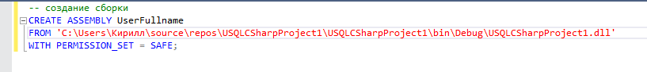

# Лабораторная работа № 3
Исполнитель: Сметанкин Кирилл, ИУ5-22М (хорошо)

## Пользовательский тип
```csharp
using System;
using System.Data;
using System.Data.SqlTypes; 
using Microsoft.SqlServer.Server; 
using System.Text;
```

## Создание Сборки
Собран проект, полученный файл dll загружен в БД




После создан тип UserFullname


## Проверка методов работы
- ToString - преобразование в строковый тип
- GetFirstName - получение имени
- GetMiddleName - отчества
- GetLastName - фамилии


## SQL

Создана таблица Test с колонкой пользовательского типа


Работа с записями таблицы


### Исходный текст скрипта
```sql
-- создание сборки
CREATE ASSEMBLY UserFullname
    FROM
    'C:\Users\Кирилл\source\repos\USQLCSharpProject1\USQLCSharpProject1\bin\Debug\USQLCSharpProject1.dll' WITH PERMISSION_SET = SAFE;

-- объявление типа
CREATE TYPE [UserFullname] EXTERNAL NAME [UserFullname];

-- использование
DECLARE @tryWithMyText[UserFullname];

SET @tryWithMyText = 'Кирилл Игоревич Сметанкин';

SELECT @tryWithMyText;

-- select @tryWithMyText.SetDelimeter('');
SELECT @tryWithMyText.ToString();

SELECT @tryWithMyText.GetFirstName();

SET @tryWithMyText = NULL;

SELECT @tryWithMyText.ToString();

SELECT @tryWithMyText.GetFirstName();

-- создание таблицы с типом
CREATE TABLE Test
(
    id       int,
    avatar   varchar(50),
    fullname UserFullName
);

INSERT INTO TEST (id, avatar, fullname)
VALUES (1, '/static/1.jpg', 'Лука Андреевич Пестов'),
       (2, '/static/default.png', 'Зиновий Иванович Бондаренко'),
       (3, '', 'Люся Ивановна Сасько');

-- пример использования таблицы
SELECT id,
       avatar,
       fullname.ToString()      AS fullname,
       fullname.GetFirstName()  AS firstname,
       fullname.GetMiddleName() AS middlename,
       fullname.GetLastName()   AS lastname
FROM test;

UPDATE
    test
SET fullname = 'Люся Ивановна Простая'
WHERE fullname.GetLastName() = 'Сасько';

SELECT id,
       avatar,
       fullname.ToString()      AS fullname,
       fullname.GetFirstName()  AS firstname,
       fullname.GetMiddleName() AS middlename,
       fullname.GetLastName()   AS lastname
FROM test;


```