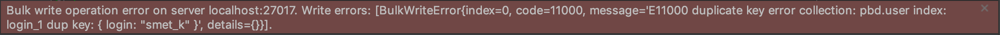

## Задание 1. Создание БД (базовое)
Создать в среде MongoDb свою БД по теме ДЗ, содержащую не менее двух коллекций.
Добавить в коллекции БД объекты сложной структуры, содержащие вложенные структуры и массивы.
Продемонстрировать (вывести на экран) содержимое коллекций.

### Пользователи
```js
db.createCollection("user");

db.user.insertMany([
    {
        "login": "smet_k",
        "password": "password_hash",
        "name": {
            "firstname": "f",
            "lastname": "l",
            "middlename": "m"
        },
        "avatar": "/static/default.png",
        "karma": 0,
        "registered": Date(),
        "languages": [
            "english",
            "russian"
        ]
    },
    {
        "login": "smet_k_1",
        "password": "password_hash",
        "name": {
            "firstname": "f_1",
            "lastname": "l_2",
            "middlename": "m_3"
        },
        "avatar": "/static/new.png",
        "karma": 1,
        "registered": Date(),
        "languages": [
            "english",
            "russian",
            "prussian"
        ]
    }
]);
```

### Статьи
```js
db.createCollection("post");

db.post.insertMany([
    {
        "header": "new post header",
        "short_topic": "post short topic",
        "main_topic": "very interesting topic ",
        "user": {
            "$ref": "user",
            "$id": ObjectId("5eb04beee244723e67ab5387"),
            "$db": "pbd"
        },
        "show": false,
        "created": Date(),
    },
    {
        "header": "another new post header",
        "short_topic": "another post short topic",
        "main_topic": "another very interesting topic ",
        "user": {
            "$ref": "user",
            "$id": ObjectId("5eb04beee244723e67ab5387"),
            "$db": "pbd"
        },
        "show": true,
        "created": Date(),
    },
    {
        "header": "another new post header new",
        "short_topic": "another post short topic new",
        "main_topic": "another very interesting topic new",
        "user": {
            "$ref": "user",
            "$id": ObjectId("5eb04ebde244723e67ab538b"),
            "$db": "pbd"
        },
        "show": true,
        "created": Date(),
    },
]);
```

---

## Задание 2. Изменение данных (базовое)
Продемонстрировать изменение объектов БД:
- добавление элемента объекта,
- изменение элемента объекта,
- удаление элемента объекта,
- замена всего объекта,
- удаление объекта.

### Добавление элемента объекта
См. Задание 1

### Изменение элемента объекта
```js
db.post.updateMany(
    { "header": "new post header" },
    { $set: { "show": true } }
);
```

### Удаление элемента объекта
```js
db.post.updateOne(
    { "header": "new post header" },
    { $unset: { "show": true } }
);
```

### Замена всего объекта
```js
db.post.replaceOne(
    { "header": "new post header" },
    {
        "header": "another new post header new",
        "short_topic": "another post short topic new",
        "main_topic": "another very interesting topic new",
        "user": {
            "$ref": "user",
            "$id": ObjectId("5eb04ebde244723e67ab538b"),
            "$db": "pbd"
        },
        "show": true,
        "created": Date(),
    }
);
```

### Удаление объекта
```js
db.post.deleteOne(
    { "_id": ObjectId("5eb05cafe244723e67ab5399") }
);
```

---

## Задание 3. Запросы к БД (базовое)
Выполнить запросы к базе данных:
- вывод всех элементов коллекции,
- вывод с фильтрацией (условия с И),
- проекция вывода (вывод части полей),
- сортировка,
- условия на поля вложенных структур, 
- поиск по элементам массива объекта.

### Вывод всех элементов коллекции
```js
db.post.find()
```

### Вывод с фильтрацией (условия с И)
```js
db.post.find(
    {
        $and: [
            { "show": true },
            { "created": { $lte: Date() } }
        ]
    }
);
```

### Проекция вывода (вывод части полей)
```js
db.post.find(
    {
        $and: [
            { "show": true },
            { "created": { $lte: Date() } }
        ]
    },
    { "id": true }
);
```

### Сортировка
```js
db.post.find(
    { $and: [{ "show": true }, { "created": { $lte: Date() } }] }
).sort({ "created": -1 });
```

### Условия на поля вложенных структур
```js
db.user.find(
    { "name.firstname": "f" }
);
```

### Поиск по элементам массива объекта
```js
db.user.find(
    {"languages": {$all: ["prussian"]}}
);
```

---

## Задание 4. Расширенные возможности (хорошо)
Выполнить запросы к базе данных:
- вывод с фильтрацией (условия И, ИЛИ, операции сравнения),
- проекция вывода (вывод конкретных полей; вывод без идентификатора),
- с условием на наличие поля, 
- вывести один элемент коллекции,
- продемонстрировать выполнение операторов count, distinct, limit,
- поиск по вложенным коллекциям объекта.

### Вывод с фильтрацией (условия И, ИЛИ, операции сравнения)
```js
db.user.find(
    {
        $or: [
            { "languages": "prussian" },
            { "languages": "russian" },
        ]
    }
);
```

```js
db.user.find(
    {
        $and: [
            { "languages": "prussian" },
            { "languages": "russian" },
        ]
    }
);
```

```js
db.user.find(
        {"languages": {$size: 2}}
);
```

### Проекция вывода (вывод конкретных полей; вывод без идентификатора)
```js
db.user.find(
    {},
    {
        "_id": 0,
        "password": 0
    }
);
```

### С условием на наличие поля
```js
db.user.find(
    {
        "login": {$exists: true}
    },
    {
        "_id": 0,
        "password": 0
    }
);
```

### Вывести один элемент коллекции
```js
db.user.findOne(
    {
        "login": {$exists: true}
    },
    {
        "_id": 0,
        "password": 0
    }
);
```

### Продемонстрировать выполнение операторов count, distinct, limit
```js
db.user.count();
```

```js
db.runCommand({ distinct: "user", key: "languages" });

db.user.distinct("languages") // не работает
```

```js
db.user.find().limit(10)
```

### Поиск по вложенным коллекциям объекта
```js
```

Продемонстрировать изменение объектов БД:
- добавление, удаление, изменение элементов массива,
- изменение нескольких объектов коллекции в одном запросе.

### Добавление, удаление, изменение элементов массива
```js
// добавление
db.user.update(
    { "_id": ObjectId("5eb04beee244723e67ab5387") },
    { $addToSet: { "languages": "tmp" } }
);

// удаление
db.user.update(
    { "_id": ObjectId("5eb04beee244723e67ab5387") },
    { $pull: { "languages": "tmp" } }
);

// обновление
db.user.update(
    { "_id": ObjectId("5eb04beee244723e67ab5387") },
    { $set: { "languages.1": "tmp" } }
);
```

### Изменение нескольких объектов коллекции в одном запросе
```js
db.post.updateMany(
    { "show": true },
    { $set: { "show": false } }
);
```

---

## Задание 5. Дополнительные возможности (отлично)
### Добавить в коллекцию связанные объекты. Продемонстрировать переход по связи в запросе.
```js
post = db.post.findOne({ _id: ObjectId("5eb055f6e244723e67ab5392") });

db.user.find({ _id: post.user.$id })
```

```json
{
	"_id" : ObjectId("5eb04beee244723e67ab5387"),
	"login" : "smet_k",
	"password" : "password_hash",
	"name" : {
		"firstname" : "f",
		"lastname" : "l",
		"middlename" : "m"
	},
	"avatar" : "/static/default.png",
	"karma" : 0,
	"registered" : "Mon May 04 2020 17:07:57 GMT+0000 (UTC)",
	"languages" : [
		"english",
		"russian"
	]
}
```


### Выполнить запрос к базе данных с группировкой и агрегированием.

### Создать уникальный индекс на одном из полей. Продемонстрировать использование индекса.
```js
db.user.createIndex({ "login": 1 }, { unique: true });
```

