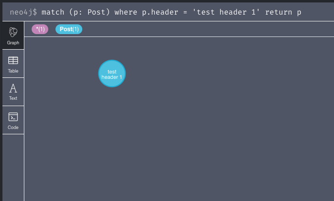

## Задание 1. Создание БД (базовая часть)
### Создать в Neo4j базу данных по теме своего ДЗ. Определить набор узлов, задать их свойства и метки.
```
create (user1: User {name: 'smet_k', avatar: '/static/default.png'})
create (user2: User {name: 'smet_k_2', avatar: '/static/avatar_new.png'})
create (user4: User {name: 'smet_k_3', avatar: '/static/avatar_old.png'})

create (post1: Post {header: 'test header', short_topic: 'test short topic', main_topic: 'test main topic'})
create (post2: Post {header: 'test header 1', short_topic: 'test short topic 1', main_topic: 'test main topic 1'})
create (post3: Post {header: 'test header 2', short_topic: 'test short topic 2', main_topic: 'test main topic 2'})
```

```
╒══════════════════════════════════════════════════════════════════════╕
│"n"                                                                   │
╞══════════════════════════════════════════════════════════════════════╡
│{"name":"smet_k","avatar":"/static/default.png"}                      │
├──────────────────────────────────────────────────────────────────────┤
│{"name":"smet_k_2","avatar":"/static/avatar_new.png"}                 │
├──────────────────────────────────────────────────────────────────────┤
│{"name":"smet_k_3","avatar":"/static/avatar_old.png"}                 │
├──────────────────────────────────────────────────────────────────────┤
│{"header":"test header","short_topic":"test short topic","main_topic":│
│"test main topic"}                                                    │
├──────────────────────────────────────────────────────────────────────┤
│{"header":"test header 1","main_topic":"test main topic 1","short_topi│
│c":"test short topic 1"}                                              │
├──────────────────────────────────────────────────────────────────────┤
│{"header":"test header 2","main_topic":"test main topic 2","short_topi│
│c":"test short topic 2"}                                              │
└──────────────────────────────────────────────────────────────────────┘
```

### Продемонстрировать (вывести на экран) содержимое БД (узлы и их свойства), используя команды Match/Where/Return.
```
match (p: Post) where p.header = 'test header 1' return p
```



## Задание 2. Отношения между узлами (базовая часть)
### Создать отношения между несколькими  узлами (с параметрами). 
```
match (p:Post),(u:User) where p.header='test header 1' and u.name = 'smet_k' create (p)-[:created_by {date: '2020-05-19'}] -> (u)
match (p:Post),(u:User) where p.header='test header 2' and u.name = 'smet_k' create (p)-[:created_by {date: '2020-05-18'}] -> (u)
match (p:Post),(u:User) where p.header='test header' and u.name = 'smet_k_2' create (p)-[:created_by {date: '2020-05-10'}] -> (u)
```


### Продемонстрировать содержимое БД (фильтрация по узлам, отношениям, меткам и связям).
#### По узлам
```
match (p:Post)-->(u:User) where p.header = 'test header 1' return p,u;
```


#### По отношениям
```
match (p:Post)-[d:created_by]->(u:User) where d.date <= '2020-05-18' return p,u
```


без статей
```
match (u:User) where not (:Post)-[:created_by]->(u) return u
```


#### По меткам и связям
```
match (p:Post)-[d:created_by]->(u:User) where d.date <= '2020-05-18' and u.name = 'smet_k' return p,u
```


## Задание 3. Запросы к БД на языке Cypher (базовая часть)
### Выполнить запросы к базе данных на языке Cypher
#### с условием NOT NULL
```
match (u:User) where u.date is null return u
```


#### оператор AND
```
match (u:User)<-[d:created_by]-(p:Post) where d.date = '2020-05-19' and u.avatar is not null return u
```


#### оператор OR
```
match (u:User)<-[d:created_by]-(p:Post) where d.date = '2020-05-19' or u.avatar is not null return u
```


#### с сортировкой
```
match (u:User)<-[d:created_by]-(p:Post) return p,d order by d.date desc
```


#### с условием на направление отношения
```
match (u:User) --> (p:Post) return u,p
```
нет результатов

```
match (u:User) <-- (p:Post) return u,p
```


#### с параметрами отношения
См сортировку